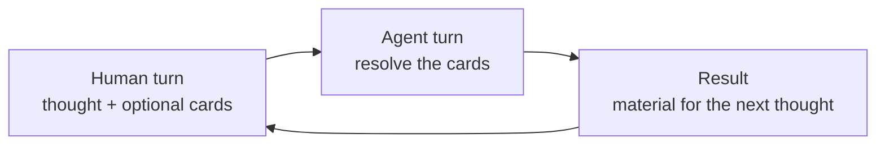

# Human-Agent Card Protocol

**Draft 0.1**

The Human-Agent Card Protocol is a draft semantic interaction protocol for cards explicitly played by a human and resolved by an AI agent.

Conversation Cards are the public interface. Each card names an effect the human wants from the agent, the result it should return, and how long that effect should remain active. The protocol defines how those cards share context, combine, resolve, and clear.

HACP is a working proposal extracted from one implemented deck. It is not a standard or a network protocol. The acronym is overloaded elsewhere, so the full name is authoritative.

## Why cards

People often mix their actual thought with instructions for the agent:

```text
This product may be a method, a tool, and a protocol.
Separate those ideas, keep useful connections, and do not choose yet.
```

The first sentence carries the thought. The second controls the next response. When that control instruction recurs, a card can name it:

```text
This product may be a method, a tool, and a protocol.
/distill
```

The card can hold a richer contract than the human would want to rewrite on every turn. The human spends less attention steering the agent and more attention developing the subject.

## One exchange



A **human turn** contains a message and zero or more explicitly played cards. An **agent turn** resolves their effects against the available context and returns a result. Together they form an **exchange**.

Without a card, the agent responds normally. Playing a card controls the requested operation, not the generated content or the final direction of the conversation.

## Shared terms

| Term | Meaning |
| --- | --- |
| **Play** | Explicitly invoke a card for an agent turn. |
| **Resolve** | Apply a card's effect under the protocol and deck rules. |
| **Effect** | The semantic transformation requested by a card. |
| **Result** | Recognizable material returned or passed to another card. |
| **Duration** | How long an effect remains active. |
| **Combo** | Several cards resolved for the same agent turn. |
| **Focus** | The material on which a combo operates. |
| **Clear** | Stop applying an effect to later turns. |

Duration is semantic. Clearing an effect does not claim that a provider unloads instructions from its context.

## Resolution rules

HACP uses four card types:

| Type | Role |
| --- | --- |
| **Focus** | Chooses the material for the combo. |
| **Move** | Transforms that material or the preceding result. |
| **Output** | Creates one structured artifact. |
| **Modifier** | Changes the final representation without changing its substance. |

Resolve a combo in this order:

```text
FOCUS? → MOVE* → OUTPUT? → MODIFIER*
```

The card type determines semantic order even when commands appear in another order. One focus card applies to the complete combo, then clears. Move cards resolve from left to right, passing each result to the next. At most one output card creates an artifact. Modifiers read the same final result or artifact rather than transforming one another.

Before applying any effect, ask one focused question when multiple focus or output cards conflict. Defaults fill omitted information directly; they do not play hidden cards. The agent never plays a move that the human did not invoke or request explicitly.

Most effects last for one agent turn. A card may declare a multi-exchange duration when its effect requires continued dialogue. A new explicit direction, another played move, completion, or a human stop ends that loop.

## Card contract

A card describes:

```text
Use when
Works on by default
Effect
Result
Duration
Limits
Combines with
Flow
Format
```

`Effect` makes the requested operation predictable without making generated content deterministic. `Result` gives the human a recognizable outcome. `Duration` tells both participants when the effect clears. `Limits` prevent a narrow card from silently becoming a broader workflow.

A useful card captures an instruction that recurs across subjects, produces a distinct result, and composes without forcing a destination.

## Deck contract

A deck applies HACP to a purpose. It defines:

- the purpose people use it for;
- the methodology that guides that purpose;
- the mental model the agent maintains as available context allows;
- the included cards and their defaults;
- any deck rules that do not replace HACP's turn and resolution rules.

The mental model belongs to the deck, not to HACP. A research deck might organize questions, claims, and evidence. A writing deck might organize intent, structure, and draft. Both can use the same card lifecycle while reasoning about different material.

## First deck

[Think It Through](https://github.com/thevzion/think-it-through) is the deck from which this draft was extracted and the first to implement its rules explicitly. It supports long, nonlinear thinking with this mental model:

```text
Conversation
└── Topics
    └── Axes
```

Its cards clarify, explore, interview, challenge, recover, propose, preserve, and operationalize human thought. The implementation embeds the HACP rules it needs and has no runtime dependency on this repository.

## Boundaries

HACP does not define transport, model APIs, tool access, persistent memory, autonomous card selection, or a required workflow. It does not authorize execution. It provides no SDK, schema, registry, certification, or conformance claim in this draft.

A deck may work inside a stricter method, project convention, or document template. Those systems govern domain reasoning and artifact structure. HACP governs played cards, their order, duration, and conversational result.

## Feedback

This draft needs evidence from more than one deck. Open a [GitHub Issue](https://github.com/thevzion/human-agent-card-protocol/issues) when a rule creates friction, a card type cannot express a useful interaction, or another deck reveals a missing invariant.

## License

MIT
